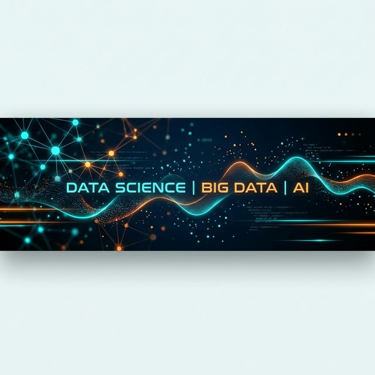

# Hi there 👋, I'm Aditya Undalkar

### 👨‍💻 Data Scientist | Big Data Engineer | AI Enthusiast

I am an aspiring **Data Scientist** and **Big Data Engineer** with a strong foundation in Computer Science. I am passionate about building AI-driven solutions, analyzing complex datasets, and deriving actionable insights to solve real-world problems.

- 🎓 **PG-DBDA** from CDAC (August 2025)
- 🎓 **B.Tech in Computer Science & Engineering** (2025)
- 🔭 I’m currently working on **Multi-Agent Systems & NLP**
- 🌱 I’m currently learning **Generative AI & Advanced Cloud Architecture**
- 👯 I’m looking to collaborate on **Data Science & AI Projects**
- 📫 How to reach me: [undalkaraditya@gmail.com](mailto:undalkaraditya@gmail.com)
- 📄 [View My Resume](https://www.linkedin.com/in/aditya-undalkar-164605251/)

---

## 🛠️ Tech Stack

### Languages

  
  
  
  

### AI & Machine Learning

  
  
  
  
  
   

### Big Data & Cloud

  
  
  
  

### Tools & Visualization

  
  
  

---

## 🚀 Featured Projects

| Project | Description | Tech Stack |
| :--- | :--- | :--- |
| **TripSync AI** | Multi-Agent Travel Recommendation System. Intelligent travel insight generation using RAG and ML models. | Python, LLM, RAG, AWS, PySpark, Tableau |
| **AI Video Transcriber** | Video Transcription, Summarization, and Keyword Extraction Tool with multilingual support. | Python, Flask, FFmpeg, NLP |
| **Credit Risk Analysis** | End-to-end EDA on consumer loan data to identify credit default risk drivers. | Python, Pandas, Matplotlib, NumPy |

---

## 📊 GitHub Stats

  
  

  

---

## 📬 Connect with Me

